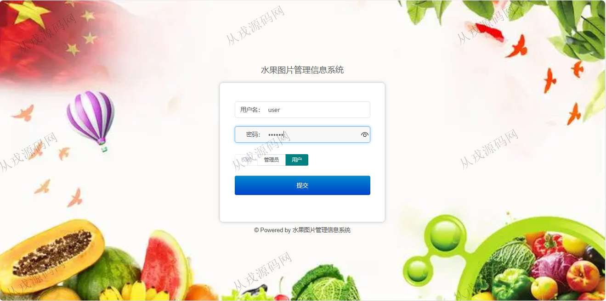
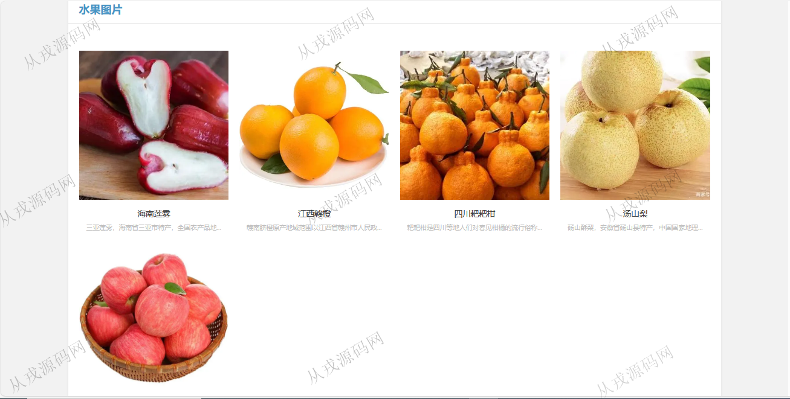
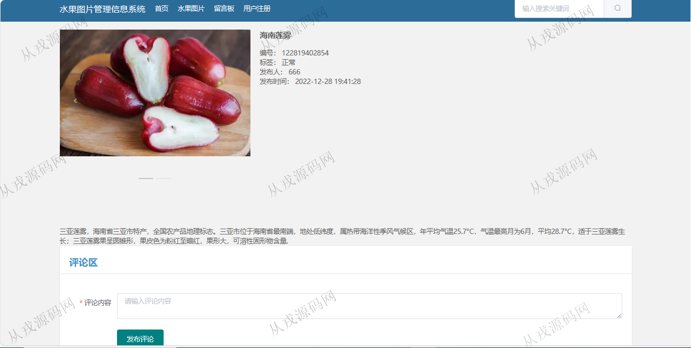
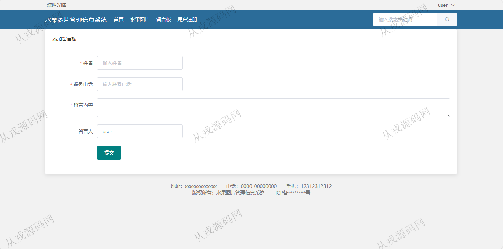
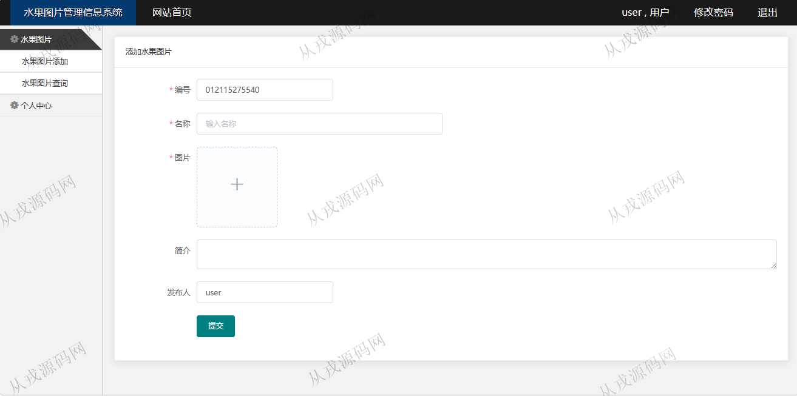
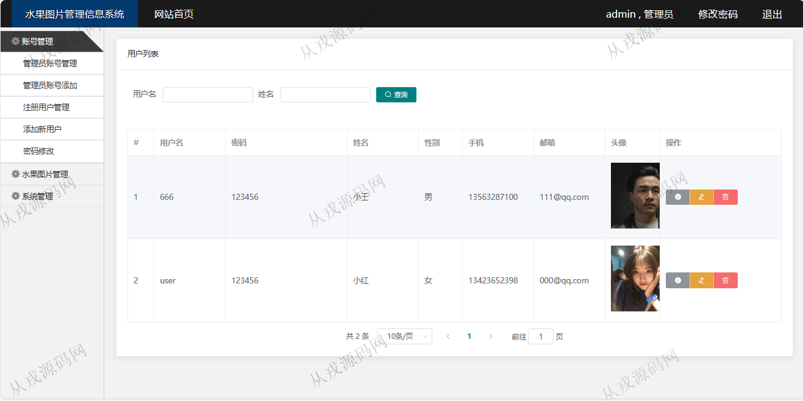
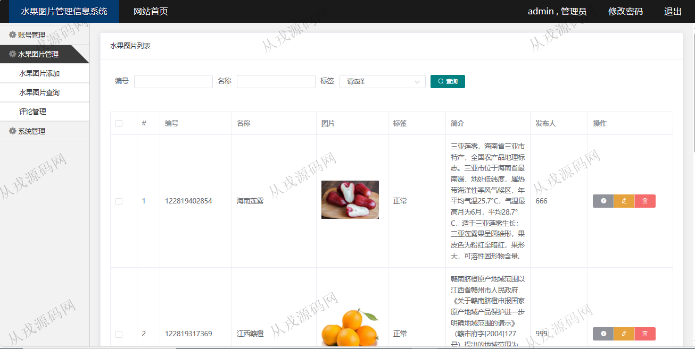
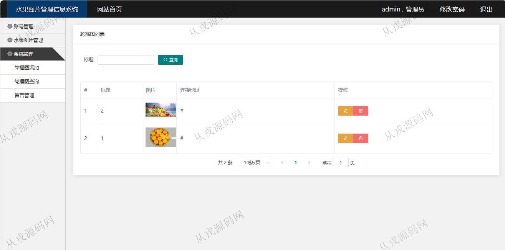

<h1 align="center">197.水果图片信息管理系统</h1>

 获取sql文件 QQ: 386869957 QQ群: 377586148 

 [更多源码项目: 从戎源码网](https://armycodes.com/) 

## 简介

> 本代码来源于网络,仅供学习参考使用!
>
> 提供1.远程部署/2.修改代码/3.设计文档指导/4.框架代码讲解等服务
> 
> http://localhost:8080/
> 
> 用户：user 123456
> 
> 管理员：admin 123456
>

## 项目介绍
基于springboot+vue2的水果图片信息管理系统：前端 vue、elementui，后端 maven、springmvc、spring、mybatis；角色分为管理员、用户；集成水果图片浏览，评论，留言板等功能于一体的系统。

## 功能介绍

### 用户

- 基本功能：登录，注册，退出
- 网站首页：主导航栏，关键词搜索，轮播图，推荐水果
- 水果图片：水果图片列表，按名称模糊搜索，按标签分类展示，详情，评论
- 留言板：发布留言信息

### 管理员

- 管理员账号管理：管理员信息的增删改查，按帐号搜索查询
- 注册用户管理：用户在前台自行注册，管理员后台查看，修改和删除
- 水果图片管理：水果图片添加，列表查询，修改，删除，图片上传
- 评论管理：对用户的评论信息进行查询，删除操作
- 系统管理：轮播图信息的增删改查，图片上传
- 留言管理：用户留言后，管理员可以查看留言信息，对留言信息进行回复

## 环境

- <b>IntelliJ IDEA 2021.3</b>

- <b>Mysql 5.7.26</b>

- <b>Node 14.14.0</b>

- <b>JDK 1.8</b>

## 运行截图

